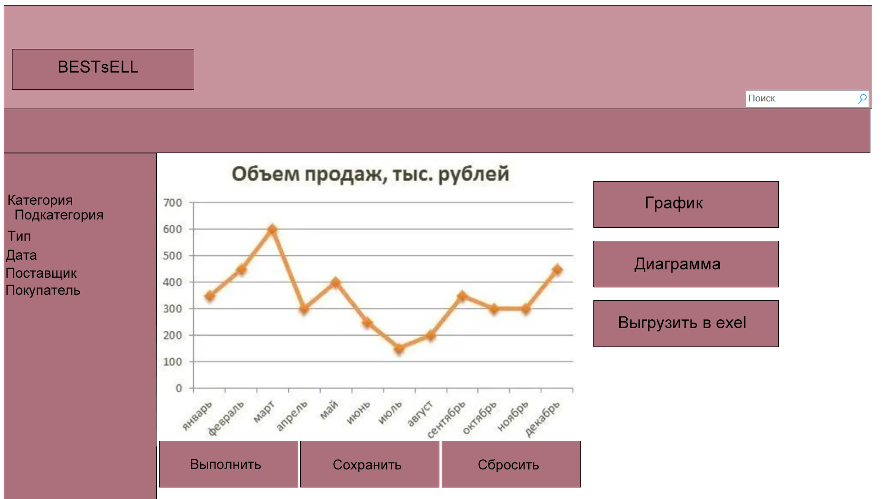
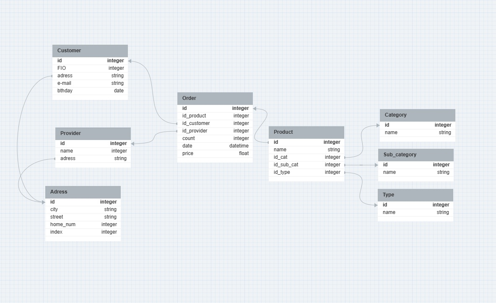
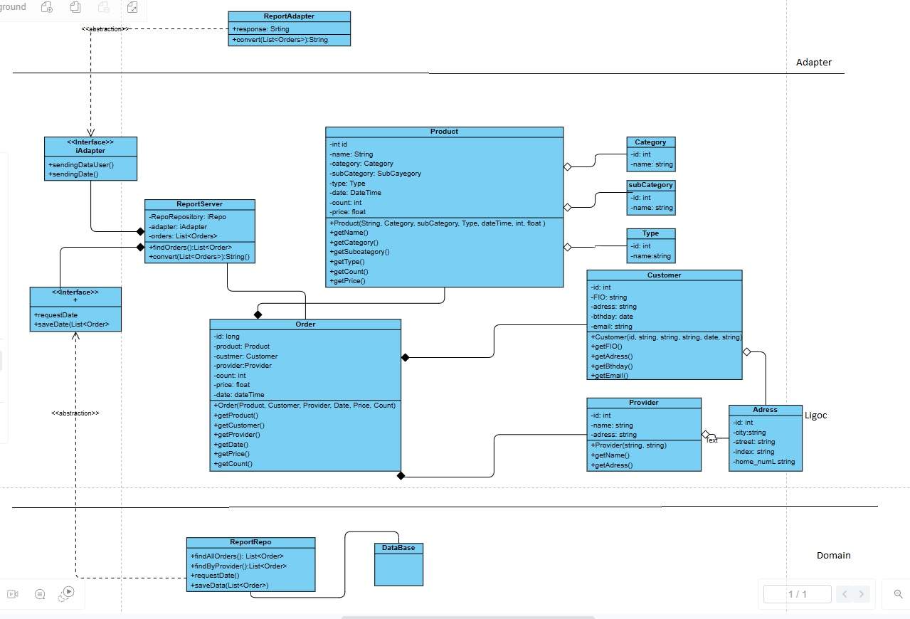

### Урок 7. Типа архитектур WEB-приложений: MPA, SPA.
Доработать экранные формы интерфейса в https://www.figma.com/ или https://app.diagrams.net/.
Разработать полную ERD домена в https://www.dbdesigner.net/.
Разработать диаграмму компонент в UML включая слои пользовательского интерфейса и бизнес-логики.

